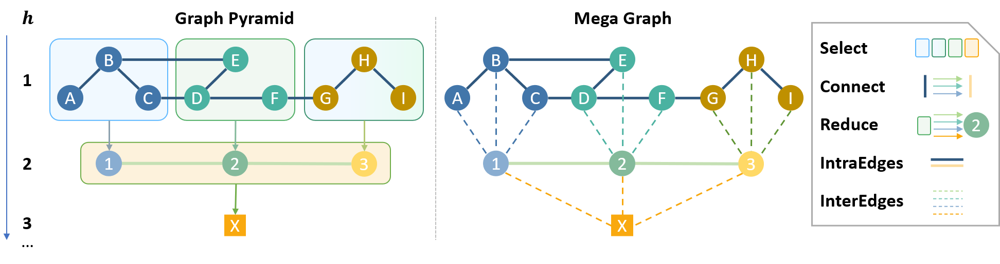
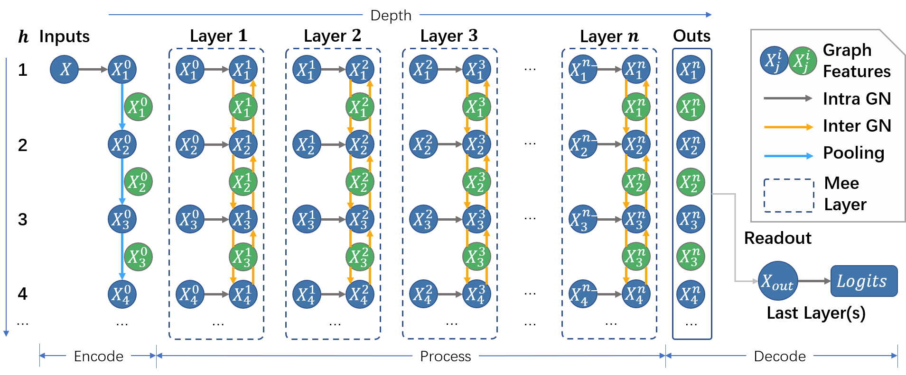

# MeGraph: Capturing Long-Range Interactions by Alternating Local and Hierarchical Aggregation on Multi-Scaled Graph Hierarchy

<div align="center" style="font-size: 28px;">
    [<a href="https://openreview.net/pdf?id=7p5YWe8GqG">📃 Paper</a>] &nbsp;&nbsp;&nbsp;
    [<a href="https://sites.google.com/view/megraph">🌐 Website</a>] &nbsp;&nbsp;&nbsp;
</div>

<div align="center">
  
  
</div>
We introduce MeGraph, a novel model for Graph Neural Networks (GNNs), focusing on effectively capturing long-range interactions (LRIs) by alternating local and hierarchical aggregation within a multi-scale graph hierarchy.

## Installation

```bash
# clone the repo
git clone https://github.com/dhh1995/MeGraph.git
cd MeGraph
```

We use python 3.9 and pytorch 1.13.0. We recommend using conda to install the dependencies:
```bash
# create a new conda environment
conda create -n graph python=3.9
conda activate graph
# prepare cudatoolkit (according to your CUDA version)
conda install cudatoolkit=11.6 -c nvidia
# install pytorch, we use pytorch 1.13.0
conda install pytorch==1.13.0 torchvision==0.14.0 torchaudio==0.13.0 pytorch-cuda=11.6 -c pytorch -c nvidia # Please install the correct version of pytorch according to your CUDA version.
# install dgl (we use dgl==1.1.0)
pip install dgl==1.1.0 -f https://data.dgl.ai/wheels/cu116/repo.html
# install torch_scatter, torch_sparse, torch_cluster, torch_spline_conv
pip install torch-scatter torch-sparse torch-cluster torch-spline-conv -f https://data.pyg.org/whl/torch-1.13.0+cu116.html
# install other dependencies
pip install -r requirements.txt
```

## Usage
The basic usage of our code is as follows:
```bash
python3 main.py --dataset-name ${dataset_name} --model ${model_name} --layer ${layer_name} --gpu-id ${gpu_id} --config-file ${config_file}`
# or equivalently
python3 main.py -dname ${dataset_name} -md ${model_name} -ly ${layer_name} -gid ${gpu_id} -cfg ${config_file}
```
where `${dataset_name}` is the name of the dataset, `${model_name}` is the name of the model, `${layer_name}` is the type of the GN block, `${gpu_id}` is the id of the GPU, and `${config_file}`(optional) is the path of the config file. For dataset that has multiple sub versions, you could set the sub version by specifying `--dataset-subname` (or `-dsub`).

When the config file is not specified, it will search the config file in the [configs](configs) folder. For detailed search strategy, please refer to the [get_default_config](megraph/io_utils.py) function.

You may also set the hyper-parameters through the command line arguments, which will **overwrite** the hyper-parameters in the config file.

## Experiments
To enhance the reproducibility of our experiments, we provide all the hyper-parameters of our experiments in the [configs](configs) folder. You could reproduce the results of our experiments by running the following commands, the config file should be found automatically.

For Graph Theory Benchmark, the dataset names and the corresponding tasks are as follows:
* `me_sssp_greg`(SP_sssd): Single-Source Shortest Path (SSSP), graph regression task.
* `me_sssp_nreg`(SP_ss): Single-Source Shortest Path (SSSP), node regression task.
* `me_diameter_greg`(Diameter): Diameter of the graph, graph regression task.
* `me_ecc_nreg`(ECC): Eccentricity of each node, node regression task.
* `me_cc_greg`(MCC): Maximum Connected Component of the same color, graph regression task.

For specific graph generation method, it is specified by the argument `--dataset-subname`. For example, to reproduce the MeGraph's results of Eccentricity task on the *medium-sized* lobster graph, you could run the following command:
```bash
python main.py -md megraph -ly gfn -dname me_ecc_nreg -dsub small_lobster
# The size in the code is `tiny`, `small` and `normal` for historical reason, where `small` and `normal` correspond to the `medium-size` and `large-size` in the paper respectively.
```

For other different graph generation methods, please refer to Appendix B.2 in the paper and `GRAPH_GENERATORS_PAIRS` in the [code](megraph/datasets/utils/graph_generators.py).

For other benchmarks, simply specify the name (and the subname) of the dataset.
```bash
# GNN benchmark: set dname to one of [zinc, aqsol, mnist, cifar10, sbm_pattern, sbm_cluster]
python main.py -md megraph -ly gfn -dname zinc

# Open Graph Benchmark (OGB): set dname to ogbg and subname to one of [molbace, molbbbp, molclintox, molsider, moltox21, moltoxcast, molesol, molfreesolv, mollipo]
python main.py -md megraph -ly gfn -dname ogbg -dsub molhiv

# Long Range Graph Benchmark (LRGB): set dname to one of [peptides_struct, peptides_func]
python main.py -md megraph -ly gfn -dname peptides_struct
```

To use Graph-UNets and HGNet, set `-md` to `UNet` and `HGNet` respectively. To change the GNN block to GCN, set `-ly` to `gcn`. Set the number of layers with `-nl`(`n_layers`) and the number of heights with `-mh`(`max_height`). 
You could tune the hyper-parametrs $\eta_v$ and $\tau_c$ by setting the `-pnr`(`pool_node_ratio`) and `-csl`(`cluster_size_limit`) respectively.
You could use your customized config by specifying `-cfg`.

## Graph Theory Benchmark
To obtain the Graph Theory Benchmark, you can simply run `main.py` with corresponding name and subnames, along with `--runs 0` (indicates no training and testing), the dataset will be generated automatically and cached if it does not exist. The default cache path is `~/.dgl/`.

The random seed for generation is set to 2022 by default.

## Contributing
We use `black` to format our code. Please use `black` to format your code before submitting a pull request.

## Citation
If you find our work useful, please cite
```bibtex
@inproceedings{dong2023megraph,
  title={MeGraph: Capturing Long-Range Interactions by Alternating Local and Hierarchical Aggregation on Multi-Scaled Graph Hierarchy},
  author={Dong, Honghua and Xu, Jiawei and Yang, Yu and Zhao, Rui and Wu, Shiwen and Yuan, Chun and Li, Xiu and Maddison, Chris J and Han, Lei},
  booktitle={Thirty-seventh Conference on Neural Information Processing Systems},
  year={2023}
}
```
